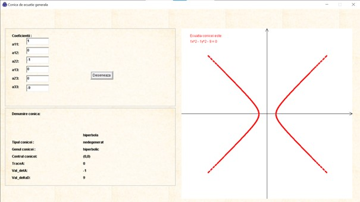
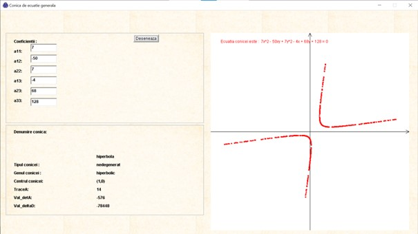

# Project ConicSectionGrapher in Java
A Java program should be written to graphically draw the conic of the general equation:

a₁₁x² + 2a₁₂xy + a₂₂y² + 2a₁₃x + 2a₂₃y + a₃₃ = 0

The program will have the following graphical interface:

1. A window containing 3 panels, objects of type Panels class (from the Buffon program).  
2. The first panel will contain 6 text boxes (objects of the TextField class), preceded by the texts: "a11:", "a12:", etc., and a button (object of the Button class). In these 6 text boxes, the user will input the values for the coefficients a11, a12, a22, a13, a23, and a33. The button will have the label "Draw", and when pressed, if no exceptions are thrown, the conic will be drawn in the third panel.  
3. The second panel will be used to display the properties of the conic (the type of the conic, the center, the values of the determinants, etc.). It will have the same dimensions as the first panel.  
4. The third panel will be used to display the conic. The coordinate axes will be drawn first in black, then the center of the conic and its axes of symmetry will be drawn in blue, and finally, the conic itself will be drawn in red.  

 
  
  
